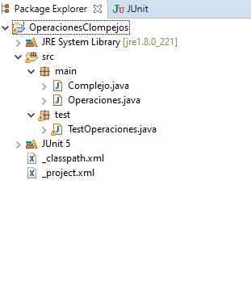
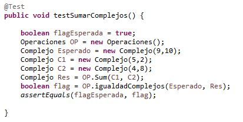
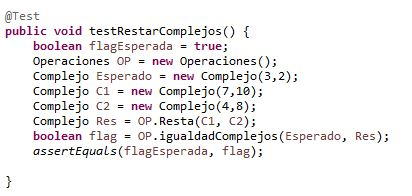
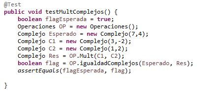
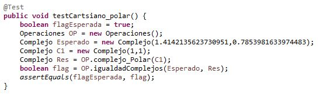
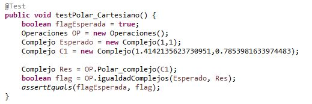

Realizado por Jimmy Andres Moya Suarez

# CNYT(Números Complejos)

En esta librería encontraran distintas operaciones copn numeros compejos.

# Pruebas

En el archivo "TestOperaciones" se encontraran las pruebas realizadas a cada una de las operaciones de la librería.

# Explicación de las pruebas

En este espacio se detallaran cada una de las pruebas que comprenden cada uno de los ejercicios realizados.

1. **Suma de complejos**
	  En este prueba se muestra que la fuinción recibe 2 numeros complejos y retorna el resultado de la suma de estos dos.
    
	

 2. **Resta de complejos**
	 En este prueba se muestra que la fuinción recibe 2 numeros complejos y retorna el resultado de la resta de estos dos.
	  
	 
	
 3.  **Multiplicación de complejos**
	En este prueba se muestra que la fuinción recibe 2 numeros complejos y retorna el resultado de la multiplicación de estos dos.
  
   
  
  4. **Division de complejos**
  En este prueba se muestra que la fuinción recibe 2 numeros complejos y retorna el resultado de la division de estos dos.
  

  
  5. **Cartesiano a Polar**
  En este prueba se muestra que la fuinción recibe 1 numero complejo y retorna su valor en polar.
  
 
  
  6. **Polar a Cartesiano**
  En este prueba se muestra que la fuinción recibe 1 numero complejo y retorna su valor en cartesiano.
  
 

